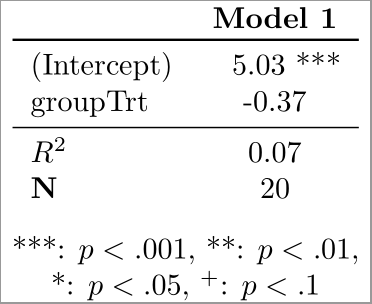

TeXtable
========

I thought I'd write a package to do something I often do by hand or try to wrangle xtable or custom code to handle: Generate publication-ready LaTeX tables from lm and lme4::lmer objects

I've fulfilled all homework requirements for now - 2 functions, non-exported helper functions, vignettes, and 3 tests for each function.

Generates these kinds of things:

