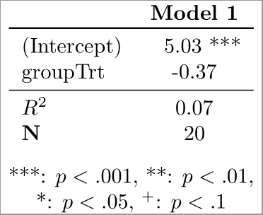
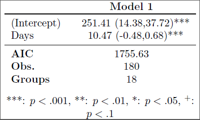

TeXtable is designed to turn your lm and lme4::lmer models into publication-ready LaTeX code that creates pretty tables like these:

## Functions

`lm_to_tex` will turn an `lm` model into a TeX file.
`lmer_to_tex` will turn an `lme4::lmer` model into a TeX file.

Both functions have the same parameters. Let's go over them.

## Parameters

First parameter is the file name (`file`). This is the name and location of the output **.tex** file.

Second parameter is a list of the models. Input it like so `list(model1, model2)`. Right now, the functions will take multiple models, but will only output the first one. If you're actually thinking of using this, stay tuned - I'll likely finish it off soon.

Third parameter is whether you want a confidence interval. By default `confint` is `TRUE` and generates the 95% confidence interval in parantheses after each coefficient.

Fourth parameter is `fit`. If `TRUE` it will output the appropriate fit value - $R^2$ for `lm` and `AIC` for `lmer`. For $R^2$, it will also add significance stars.

Fifth parameter is the `sample.size`, which just adds the sample size to the table.

Finally, you can specify the number of decimal places with `decimals`. By default it's set to 2 decimal places.

Hope you find this helpful!

## Homework stuff

All homework requirements have been met.